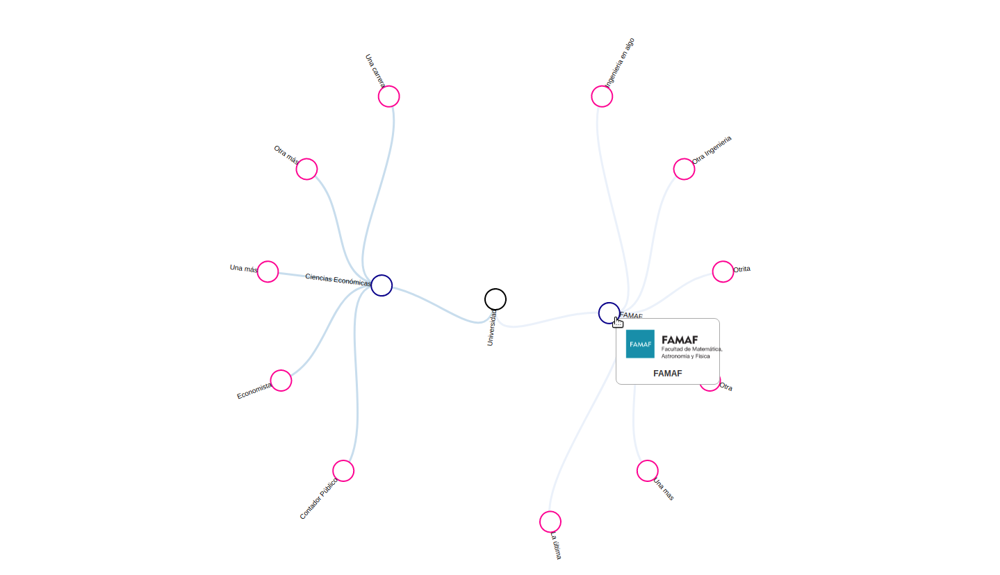

# Dendrograma de Facultades y carreras universitarias

Visualización de nodos con todos las facultades y carreras de una Universidad

### Datos de base

# Dendograma

[Link a la visualización](https://avdata99.github.io/dendrograma-universidad/index.html)

## Parámetros opcionales

La URL puede recibir estos parámetros GET:

* radio: Radio del dendograma. [Ejemplo](https://avdata99.github.io/dendrograma-universidad/index.html?radio=500)
* select: Muestrar/Ocultar filtro de secretarias: [Ejemplo](https://avdata99.github.io/dendrograma-universidad/index.html?select=1)
* facultades: Arreglo con las facultades a filtrar: [Ejemplo](https://avdata99.github.io/dendrograma-universidad/index.html?facultades=["FAMAF"])
